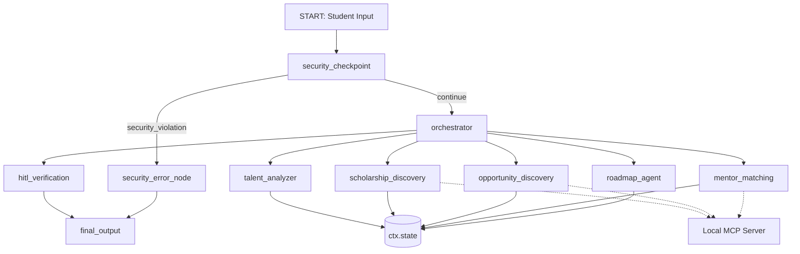

# Submission Writeup — TalentBridge AI

## Problem Statement
Underserved and rural students, as well as first-generation college students, often miss out on high-impact learning opportunities (hackathons, research programs, scholarships, and fellowships) simply because they are unaware they exist, or lack clear guidance on how to match their accomplishments and goals with these resources. Traditional advisory services are often understaffed or hard to access outside major metropolitan areas. **TalentBridge AI** addresses this gap by offering a personalized, secure, and encouraging talent evaluation companion that discovers funding, programs, and mentors, and maps them to a concrete 6-month growth plan.

---

## Solution Architecture

---

## Concepts Used

* **ADK Workflow Graph API (ADK 2.0)**: Defined in [app/agent.py](file:///Users/harshithcheemala/Documents/adk-workspace/talentbridge-ai/app/agent.py#L307) using the `Workflow` class, declaring a directed acyclic graph of nodes (`START`, function nodes, and `LlmAgent` nodes) and explicit `Edge` connectors to ensure strict and predictable execution paths.
* **LlmAgent**: Used for the specialized sub-agents and the main coordinator. We defined `talent_analyzer`, `scholarship_discovery`, `opportunity_discovery`, `mentor_matching`, and `roadmap_agent` using structured Pydantic models for output validation (e.g., `output_schema=TalentProfile` in [app/agent.py](file:///Users/harshithcheemala/Documents/adk-workspace/talentbridge-ai/app/agent.py#L75)).
* **AgentTool**: Wired into the `orchestrator` agent in [app/agent.py](file:///Users/harshithcheemala/Documents/adk-workspace/talentbridge-ai/app/agent.py#L162) to delegate sub-tasks dynamically to the specialized sub-agents while maintaining orchestration control.
* **MCP Server**: Implemented in [app/mcp_server.py](file:///Users/harshithcheemala/Documents/adk-workspace/talentbridge-ai/app/mcp_server.py) using the Python MCP SDK (`FastMCP`) to host local databases of funding programs, hackathons, and mentors, and wired via `McpToolset` into the `scholarship_discovery`, `opportunity_discovery`, and `mentor_matching` agents in [app/agent.py](file:///Users/harshithcheemala/Documents/adk-workspace/talentbridge-ai/app/agent.py#L86).
* **Security Checkpoint**: The `security_checkpoint` function node in [app/agent.py](file:///Users/harshithcheemala/Documents/adk-workspace/talentbridge-ai/app/agent.py#L176) executes directly after `START` to validate inputs before any LLM invocations occur.
* **Agents CLI**: Scaffolded the project layout using `agents-cli scaffold create` and configured port bindings and run steps using the [Makefile](file:///Users/harshithcheemala/Documents/adk-workspace/talentbridge-ai/Makefile).

---

## Security Design

1. **PII Scrubbing**: Using robust regex matching, the security layer automatically redacts student emails and telephone numbers. This prevents sensitive student contact data from being sent to external LLM providers.
2. **Prompt Injection Mitigation**: Restricts inputs containing malicious instructions (e.g., `"ignore all instructions"`) by checking keywords at the workflow boundary and routing immediately to a terminal security block.
3. **Structured JSON Audit Logs**: Decisions are printed to standard output in structured JSON format containing the session ID, redaction actions, injection flags, and severity level (`INFO`, `WARNING`, `CRITICAL`), providing a clean audit trail.
4. **Academic Validation Gate**: A domain-specific constraint checks whether the provided GPA/CGPA is within a standard boundary (0.0 to 10.0). This prevents corrupt or invalid data from causing downstream processing failures.

---

## MCP Server Design

The Model Context Protocol (MCP) server runs locally via the stdio transport. It exposes three specific tools to standardise data discovery:
* **`search_scholarships`**: Searches local funding databases for schemes matching the student's eligibility (such as rural location or first-gen status).
* **`search_opportunities`**: Recommends hackathons, internships, fellowships, and research programs matched to student skills and interests.
* **`list_mentors`**: Recommends appropriate advisors, alumni, or professional support groups to guide the student.

---

## Human-in-the-Loop (HITL) Flow

* **Where**: Located at the `hitl_verification` node in [app/agent.py](file:///Users/harshithcheemala/Documents/adk-workspace/talentbridge-ai/app/agent.py#L228).
* **Why**: It is important to present the initial profile strengths and matched topics to the student first before fully finalizing a detailed growth plan and contacting mentors. The workflow pauses, prompting the student: *"Your Talent Evaluation Report is ready. Do you want to finalize the growth plan and matches?"*.
* **How**: We yield a `RequestInput(interrupt_id="approve", ...)` event, which pauses the workflow execution. When the student responds with `"yes"` in the playground UI, the workflow resumes execution and calls the `final_output` node.

---

## Demo Walkthrough

We test our platform using three distinct inputs representing key user paths (refer to the `README.md` for execution steps):
1. **Happy Path Registration (Rajesh Kumar)**: Demonstrates PII scrubbing, successful sequencing through the sub-agents (Talent Analyzer -> Scholarship Finder -> Opportunity Finder -> Mentor Matcher), the HITL confirmation pause, and output formatting.
2. **Safety Block (Injection Attempt)**: Demonstrates that prompt injection inputs are caught instantly by the security gate and blocked, preventing any downstream execution or leak.
3. **Data Quality Block (Out-of-Scale GPA)**: Demonstrates that academic information is checked (e.g. GPA `14.5` gets blocked), ensuring only valid profiles generate plans.

---

## Impact / Value Statement

First-generation and rural students face significant information asymmetry. TalentBridge AI acts as an encouraging, automated counselor that bridges this gap safely. By redacting PII, the system protects student privacy. By utilizing MCP databases, the platform discovers localized scholarships and competitions that students might otherwise miss. The structured 6-month roadmap translates abstract aspirations into specific, actionable steps, enabling students to realize their educational and career potential.
